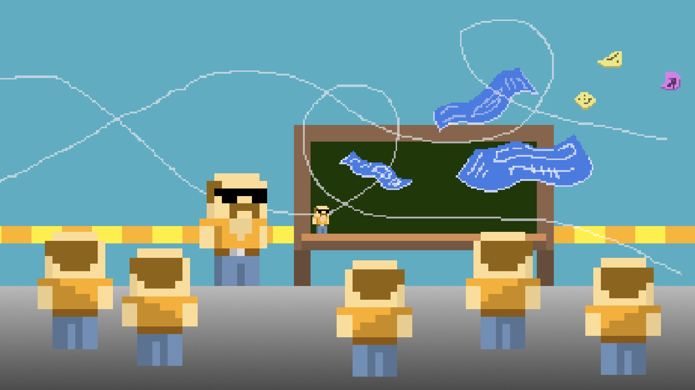
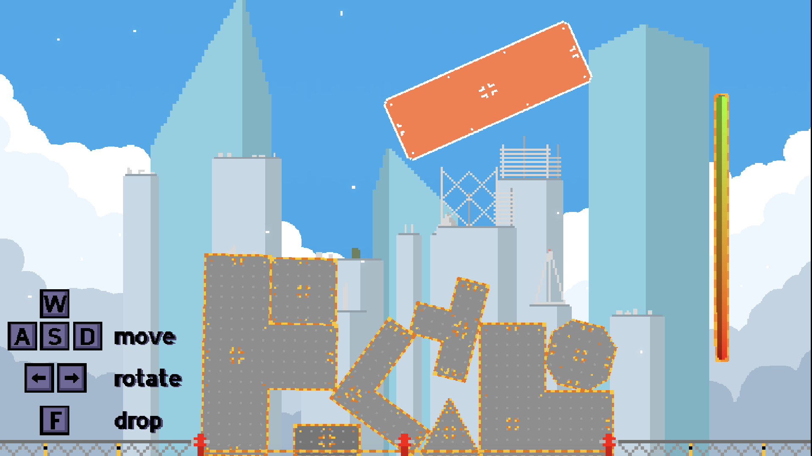

# Scaling Vertically

In this game, you play as a builder who loses his blueprints but decides to go
ahead and build a skyscraper anyway. The game plays like Tetris, except the
blocks do not snap to a grid or fit together neatly. Your goal is to try and
keep the building pieces packed close together as you drop them into place to
prevent the building from becoming too unstable.

## Backstory

This is a game made by me (I did pretty much all of the programming) and
[Ryan](https://github.com/RyanTurley) (who handled the artwork) over the course
of a long weekend for the [2024 GMTK Game Jam](https://itch.io/jam/gmtk-2024).
The music and sound effects for the game were created by our friend Will.

This was my first time making anything in Godot that wasn't from a tutorial (I
started learning Godot a few days before the jam) and Ryan had never used Git,
GitHub, or any kind of version control before. Despite all this, I think the
game turned out pretty well and is definitely fun.

## How to Play

You can play the game in your browser or download the x64 Windows build
[here](https://drew-abbo.itch.io/scaling-vertically). You could also clone this
repo and use Godot 4.3 (not the .NET one) to play or export it directly from the
game engine.
